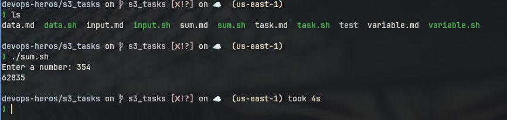

# sum.sh

## Code

```bash
#!/bin/sh

read -p "Enter a number: " no
sum=0
for ((i = 0; i <= no; i++)); do
    sum=$((sum + $i))
done

echo $sum
```

## Output

```
Enter a number: 354
62835
```

## Screenshot


